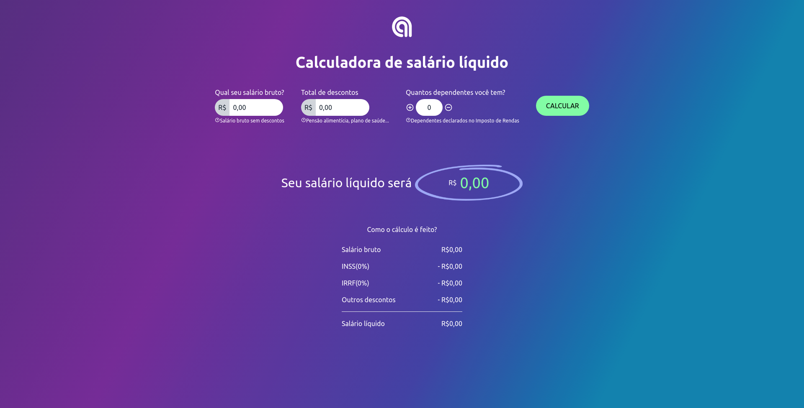
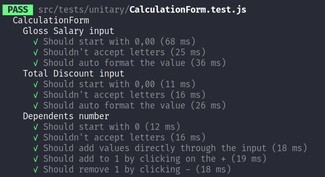

<div align='center'>

# [Calculadora Agilize](https://calculadora-agilize.herokuapp.com/)
</div>

Calcula o salário líquido da pessoa usuária deduzindo o INSS, IRRF e outros descontos.

[](https://calculadora-agilize.herokuapp.com/)

Aplicação desenvolvido para o desafio técnico de front-end da [Agilize](https://agilize.com.br/).

---

## Tecnologias utilizadas
- ### **React** - Como tecnologia base para criação da interface;
- ### **ContextAPI** - Para o compartilhamento de estado entre os componentes;
- ### **Tailwind** - Para facilitar a estilização dos componentes;
- ### **ReactTestLibrary** - Para o desenvolvimento dos testes;
- ### **Gitemoji** + **Commitzen** - Para padronizar os commits;

---

## Estrutura de pastas
Estrutura de dados baseado no [Atomic Design React](https://danilowoz.com/blog/atomic-design-with-react)
```js
src
├── components //Molecules
├── fields //Organisms
├── modules // Templates
├── images
├── tests
│   ├── integration
│   └── unitary
└── utils
```

---

## Iniciando a aplicação

Primeiro é necessário fazer o clone da aplicação:
```
git clone git@github.com:dcmatheus/calculadora-agilize.git
cd calculadora-agilize
```
Instalar as dependências:
```dotnetcli
npm install
```
A aplicação é iniciada com o comando:
```
npm start
```
Ou via docker:
```bash
docker build -t calculadora-agilize .
docker run -p 3000:3000 calculadora-agilize
```
Ficando disponível em http://localhost:3000/

---

## Deploy

O deploy foi feito utilizando o [Heroku](https://dashboard.heroku.com/) com o build pack [mars/create-react-app-buildpack](https://elements.heroku.com/buildpacks/mars/create-react-app-buildpack).

Link do Deploy: https://calculadora-agilize.herokuapp.com/

---

## Testes

A aplicação foi construida baseado no modelo [TDD](https://www.devmedia.com.br/test-driven-development-tdd-simples-e-pratico/18533). Os testes referentes aos componentes foram escritos antes deles funcionarem em si. Em alguns componentes não foi possível fazer testes unitários, mas estão englobados no teste de Integração.

### Comando para rodar os testes:
```
npm run test
```
**Obs:** O nome do arquivo de testes pode ser passado como parâmetro para uma descrição mais detalhada.



---
