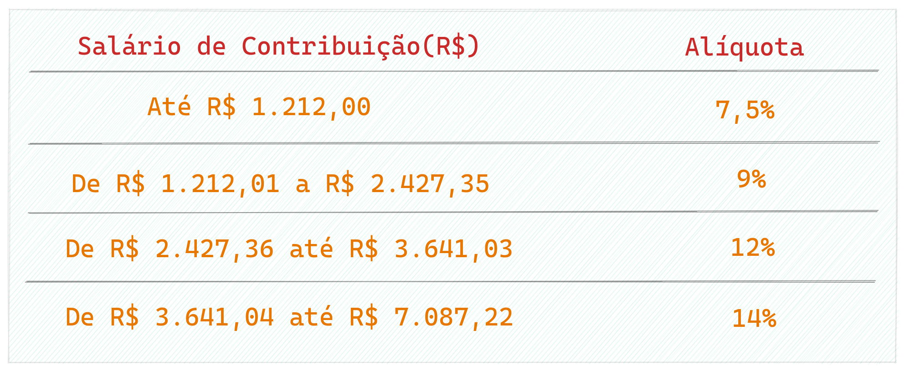
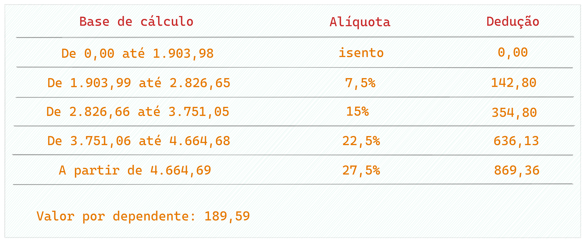
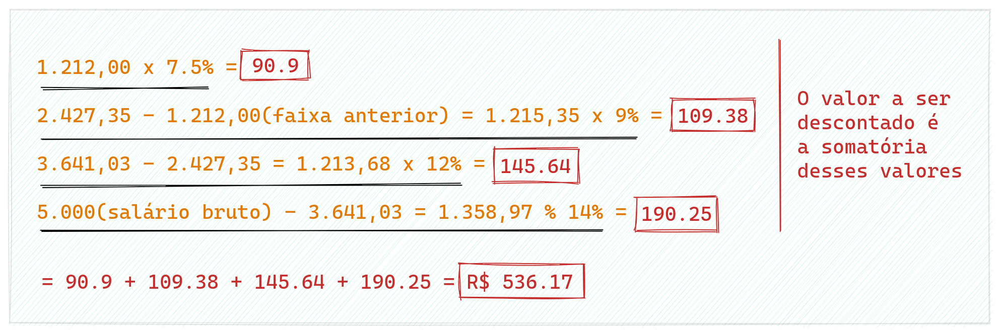
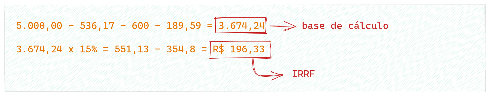
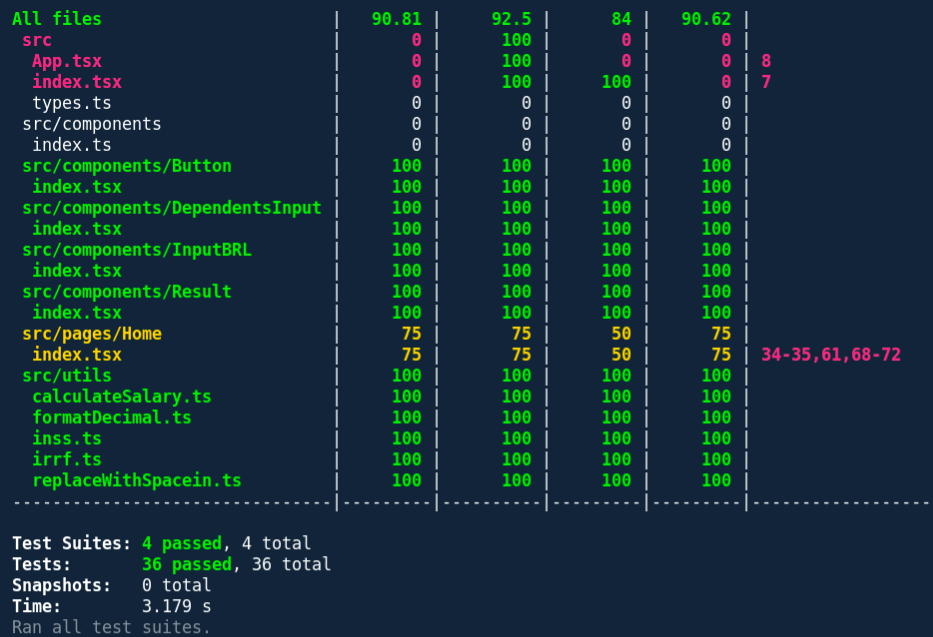
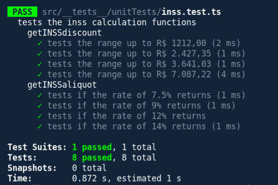

</img>

<br />

# <h1>Calculadora de Salário Líquido</h1>

<br />

> Bem vindos ao repositório! esta calculadora foi desenvolvida para obter um valor de salário líquido a partir do salário bruto e os principais descontos do salário (INSS e IRRF) também está atualizada de acordo com as regras de 2022 do [ministério da economia](https://www.ministeriodotrabalho.org/imposto-de-renda-aliquotas-e-tabela-atualizada-do-irpf/)

<br />

Visite o [site](https://calculadora-salario-liquido.vercel.app/)

<br />

## Sumário

- [Tecnologias utilizadas](#tecnologias-utilizadas)
- [Como executar o projeto](#como-executar-o-projeto)
- [Como o cálculo é feito](#como-o-cálculo-é-feito)
  - [Calculando o desconto do INSS](#calculando-o-desconto-do-inss)
  - [Calculando o desconto do IRRF](#calculando-o-desconto-do-irrf)
  - [Calculando o salário líquido](#calculando-o-salário-líquido)
- [Estrutura dos dados e o algoritmo do cálculo](#estrutura-dos-dados-e-o-algoritmo-do-cálculo)
- [Testes](#testes)
- [UI/UX](#ui/ux)

<br />

## Tecnologias utilizadas
---

- React.js
- Sass
- Typescript

<br />

## Como executar o projeto
---

Primeiro faça o clone: 

```bash
git clone https://github.com/thalysmcarrara/calculadora_salario_liquido.git
```

Instale as dependências:

```bash
npm install
```

por fim:

```bash
npm start
```
<br />

## Como o cálculo é feito
---


Todo o cálculo é baseado nas tabelas do INSS e do IRRF.

### Tabela do INSS

<br />


</img>


<br />

### Tabela do IRRF


</img>

Em regras gerais a fórmula do cálculo é: `salário líquido = salário bruto - INSS - IRRF - outros descontos(pensão alimentícia, dependentes, previdência privada)`.

Porém, existem algumas nuances a serem esclarecidas, tanto o cálculo do desconto do INSS quanto do IRRF são feitos de forma progressiva, ou seja, não se pode aplicar a alíquota direta em cima do salário bruto, o desconto é calculado de forma retroativa as faixas anteriores e descontos ao salário bruto desejado. Por exemplo:

<br />

### Calculando o desconto do INSS:
---

Digamos que você receba um salário de R$ 5,000.00, você se enquadra na faixa dos 14% de alíquota, mas como já foi dito, não pode calcular de forma direta ( `salário bruto - 14%` ) o cálculo correto é:


</img>

Lembrando também que o teto máximo de contribuição para salários acima de R$ 7,087.22 é de `R$ 828.39`

<br />

### Calculando o desconto do IRRF:
---

O IRRF não é calculado em cima do salário bruto, e sim sobre o `salário bruto - despesas(INSS, pensão, dependentes...)` e o resultado disso multiplicado pela alíquota menos a dedução. Imaginando um cenário onde você ganha R$ 5,000.00, seu desconto do INSS é de R$ 536,17 e você possui 1(um) dependente declarado, também paga pensão de R$ 600. 

**🚨 É importante saber que a cada dependente declarado desconta-se um valor de R$ 189,59**

A conta fica:


</img>

<br />

### Calculando o salário líquido:
---

<br />

Por fim temos:


</img>

<br />

## Estrutura dos dados e o algoritmo do cálculo
---

<br />

Os dados das tabelas do INSS e IRRF foram transformados em arrays de objetos onde cada objeto corresponde a uma faixa salarial da tabela, no algoritmo cada faixa salarial é chamada de *`range`*.

Pensando em modularização e desacoplamento a função `calculateSalary()` foi dividida em outras 4 funções `getINSSAliquot(), getINSSdiscount(), getIRRFAliquot()` e `getIRRFdiscount()`.

A função `calculateSalary()` também fica com a responsabilidade de formatar os dados para o formato de moeda antes de retornar, para reduzir a complexidade e poluição visual dos componentes, deixando com que o componente seja responsável apenas pela renderização.

<br />

## Testes
---

Os testes estão divididos em 2 tipos, testes de interface usando a `react-testing-library` e testes unitários usando apenas o `Jest` para testar a regra de negócio.

Para executar os testes e verificar a cobertura dos mesmos basta rodar o comando:

```bash
npm test -- --coverage --watchAll
```
está com uma cobertura de quase 100%


</img>

<br />

Após rodar este comando será criado uma pasta chamada `coverage` que contém um arquivo html que pode ser executado no navegador para ter mais detalhes sobre a cobertura.

Caso queira executar cada teste separadamente basta executar:

```bash
npm test src/__tests__/:diretorio-do-teste-desejado:

#exemplo 

npm test src/__tests__/unitTests/inss.test.ts
```


</img>

<br />

## UI/UX
---

>Caso o usuário clique no botão de `CALCULAR` sem preencher o  campo do salário é emitido um alerta.

>Ao carregar a página o input de salário é focado

<br />

[](https://www.linkedin.com/in/thalys-matias-carrara/)